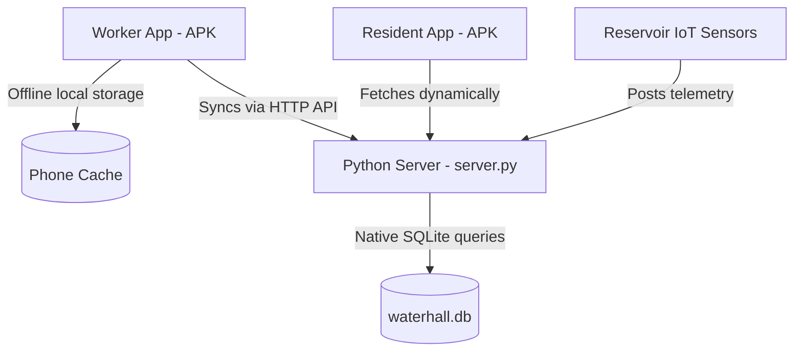

# WATERHALL: IoT Water Management System
## Capstone Project Deliverables 1 Report (UI, Core Functions, & Database)

This document serves as the official submission package for **Deliverables 1**. It summarizes the system architecture, database schema, user interface features, and core offline-first logic for review.

---

## 🏗️ 1. System Architecture

WATERHALL uses a **Client-Server local network architecture** designed to operate in areas with intermittent or zero internet coverage:



---

## 🗄️ 2. Database Implementation (SQLite)

The backend service has been migrated from temporary JSON file storage into a native, relational SQLite database ([`waterhall.db`](file:///c:/Users/Windows/Documents/capstone/WATER-HALL_DART/waterhall.db)) managed in [`server.py`](file:///c:/Users/Windows/Documents/capstone/WATER-HALL_DART/server.py). 

### Database Schema Table Definitions:

1.  **`workers` Table:** Holds authorized technician logins and zone credentials.
    ```sql
    CREATE TABLE IF NOT EXISTS workers (
        worker_id TEXT PRIMARY KEY,
        name TEXT NOT NULL,
        role TEXT NOT NULL,
        selected_zone TEXT NOT NULL
    );
    ```
2.  **`households` Table:** Manages residential water meters, MAC addresses, flow rates, and leak statuses.
    ```sql
    CREATE TABLE IF NOT EXISTS households (
        house_id TEXT PRIMARY KEY,
        owner_name TEXT NOT NULL,
        account_number TEXT NOT NULL,
        purok TEXT NOT NULL,
        current_leak_status TEXT DEFAULT 'normal',
        flow_rate REAL DEFAULT 0.0,
        leak_detected_at TEXT,
        monthly_history TEXT NOT NULL,
        current_m3_usage REAL DEFAULT 0.0
    );
    ```
3.  **`billing_records` Table:** Houses water invoices, usage totals, fees, and collection statuses.
    ```sql
    CREATE TABLE IF NOT EXISTS billing_records (
        bill_id TEXT PRIMARY KEY,
        house_id TEXT NOT NULL,
        account_number TEXT NOT NULL,
        billing_month TEXT NOT NULL,
        previous_reading REAL NOT NULL,
        current_reading REAL NOT NULL,
        consumption REAL NOT NULL,
        water_charge REAL NOT NULL,
        environmental_fee REAL NOT NULL,
        total_due REAL NOT NULL,
        status TEXT DEFAULT 'Pending',
        billed_by TEXT,
        date TEXT NOT NULL,
        FOREIGN KEY(house_id) REFERENCES households(house_id)
    );
    ```
4.  **`maintenance_logs` Table:** Logs repair tickets, technician actions, and resolution logs.
    ```sql
    CREATE TABLE IF NOT EXISTS maintenance_logs (
        task_id TEXT PRIMARY KEY,
        house_id TEXT NOT NULL,
        worker_id TEXT NOT NULL,
        description TEXT NOT NULL,
        status_resolved INTEGER DEFAULT 0,
        date TEXT NOT NULL,
        FOREIGN KEY(house_id) REFERENCES households(house_id)
    );
    ```
5.  **`reservoir_quality_readings` Table:** Records central reservoir physical telemetry (pH levels, turbidity clarity, tank depth).
    ```sql
    CREATE TABLE IF NOT EXISTS reservoir_quality_readings (
        id INTEGER PRIMARY KEY AUTOINCREMENT,
        main_tank_level INTEGER NOT NULL,
        ph_level REAL NOT NULL,
        ph_status TEXT NOT NULL,
        ph_desc TEXT NOT NULL,
        turbidity REAL NOT NULL,
        turbidity_status TEXT NOT NULL,
        turbidity_desc TEXT NOT NULL,
        last_updated TEXT NOT NULL
    );
    ```

---

## 📱 3. User Interface (UI) Design

We compiled **two separate Android Apps** to keep roles segregated:

*   **🛠️ WATERHALL Worker App ([`waterhall-worker.apk`](file:///c:/Users/Windows/Documents/capstone/WATER-HALL_DART/waterhall-worker.apk)):**
    *   **Worker Login:** Displays credentials input and Purok assignment picker. Only accepts employee IDs (e.g. `EMP-304`).
    *   **Dashboard View:** Displays active warnings, interactive SVG flow pins, and recent logs.
    *   **Directory View:** Supports fuzzy search for household accounts, filter by Purok, and toggle simulated leak statuses on/off.
    *   **Assets View:** Displays central reservoir visual level bars and sensor parameters. Contains an **IoT Telemetry Hardware Simulator** panel.
    *   **Billing View:** Contains base rate, excess consumption calculations, environmental fees, and billing logs history.
*   **🏠 WATERHALL Resident App ([`waterhall-resident.apk`](file:///c:/Users/Windows/Documents/capstone/WATER-HALL_DART/waterhall-resident.apk)):**
    *   **Resident Login:** Clean layout asking for account number (e.g., `TAG-2026-0041`). The Purok selector and employee login options are completely hidden.
    *   **IoT Live Telemetry Card:** Shows central reservoir level (%), pH index, turbidity (NTU), and water safety rating (`SAFE` / `ALERT`).
    *   **Water Statement Receipt:** Displays the breakdown of the current cycle base rate, excess usage charges, environmental fees, and payment status.
    *   **Consumption Graph:** Displays a custom SVG vector line graph representing monthly consumption history.
    *   **Tickets log:** Allows submitting leakage alerts directly to the maintenance board.

---

## ⚡ 4. Core Functions & Offline Sync Engine

1.  **Store-and-Forward Caching:** 
    *   If the worker goes to a remote water meter out of network range, the app automatically falls back to **Local Cache Mode**.
    *   All offline entries (new bills, maintenance reports, leak status flips) are saved securely to the phone's persistent browser storage (`window.localStorage`). Data survives phone restarts.
2.  **Persistent Sync Queue:** 
    *   Offline changes are logged to `waterhall_unsynced_actions`.
    *   The app registers a **system network listener**. The moment the phone connects to the internet (or on app boot), the sync engine automatically loops through the queue, uploads data to the SQLite database on the server, and clears the cache.
3.  **Real-Time Polling Loop:** 
    *   Both apps run a background timer loop every **5 seconds** to fetch updates from the SQLite server.
    *   If a technician updates a leak status, or if the IoT node updates the pH index, the resident's portal refreshes dynamically within 5 seconds without reloading the page.

---

## 🎬 5. Live Demonstration Script (For the Professor)

To present this system to your professor, perform these steps:

### Step 1: Run the Server
1.  Open the workspace folder on your base station PC.
2.  Start the backend Python server:
    ```cmd
    python server.py
    ```
3.  Verify the server is listening: `http://localhost:8000`.

### Step 2: Show the Worker App Role Separation
1.  Open the **WATERHALL Worker** app (or navigate to `http://localhost:8000/index.html?role=worker`).
2.  Point out that the login screen displays employee options.
3.  Type a resident account number (`TAG-2026-0041`) -> **Blocked** (Demonstrates role constraints).
4.  Type worker credentials (`EMP-304`) -> **Success**.

### Step 3: Show the Resident App Live Telemetry
1.  Open the **WATERHALL Resident** app (or navigate to `http://localhost:8000/index.html?role=resident`).
2.  Notice that the worker inputs are hidden. Log in using `TAG-2026-0041` -> **Success**.
3.  Show the **Central Reservoir Telemetry (IoT Live)** card.
4.  On the PC (Worker Assets screen), adjust the simulated pH level slider.
5.  **Watch the Resident Phone Screen:** The pH value and safety rating update dynamically in 5 seconds without reloading (Demonstrates the background polling loop and database responsiveness).

### Step 4: Show the Offline-to-Online Store & Forward Sync
1.  Disconnect the server PC from the Wi-Fi router (simulate going offline in the field).
2.  On the Worker App, enter a new water bill for a household.
3.  Show that the bill is successfully saved locally on the phone list.
4.  Close and reopen the app while offline -> show that the local bill is **still there** (Demonstrates persistent browser caching).
5.  Reconnect the PC server to the network.
6.  **Watch the server command prompt:** It will output: *"Found unsynced offline operations. Starting auto-upload..."* followed by successful synchronization logs.
7.  Check the database or log into the Resident App -> show that the resident's ledger has updated (Demonstrates automatic background sync queueing).
